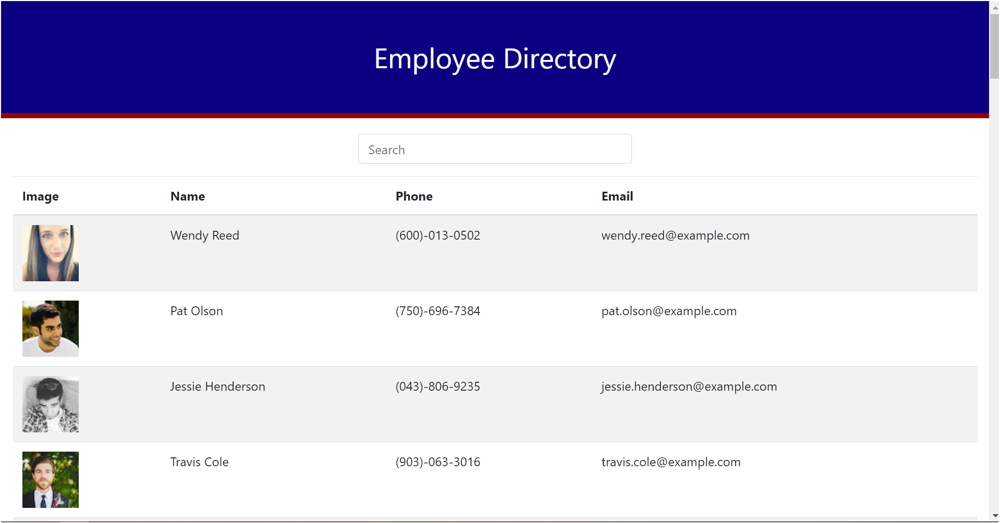

# employee-directory

## Description

Employee Directory is a react app that allows an employer the ability to view non-sensitive data about their employees. The employer can sort and view names in ascending or descending order, or use the search bar to search for a specific name.

## Getting Started

1. Clone repository to local directory.
2. Download and install **_Nodejs_**.
3. Open terminal in code editor or via machine.
4. Navigate to the the app folder, run **_npm install_** to install the dependencies needed.
5. Run **_npm start_** to start the application.

## Built With

- [Nodejs](https://nodejs.org/)
- [NPM](https://www.npmjs.com/)
- [React](https://reactjs.org/)

## Deployed Link

[Deployed Application](https://jbrown827.github.io/employee-directory/)

## Authors

- **Jaja Brown**
  - [Portfolio](https://chee-codes.github.io/portfolio/)
  - [GitHub](https://github.com/chee-codes)
  - [LinkedIn](https://www.linkedin.com/in/jaja-b-a42261201/)
